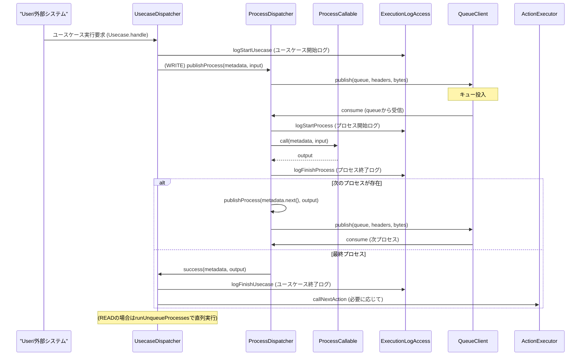

# 今週の予定
- [x] 辰夫さんに説明する用の、Shinise開発でやった貢献まとめ
- [ ] 同じスパン名を持ち、かつ全ての期間内のスパンIDで集計をとり、処理時間を測定する必要あり。
	- [x] Google Traceについて調査
	- [x] 設計
	- [x] 実装
	- [ ] 動作チェック
- [ ] スパン名単位で処理時間を計測し、ボトルネックを報告
- [ ] Gatlingによる確認
	- [x] SalesContinuousSimulation
	- [ ] LargeFileSimulation
	- [ ] BurstSimulation
- [x] 定期的にstock-conversion-serviceやnew-stock-serviceが死んでいることを通知するやつを作る
- [ ] GraphQL API負荷テスト用Locustファイル作成

## 自己学習
- [ ] OpenTelemetryを読破する
- [ ] 記事を１つ書く
---
# 今日のタスク (Tasks)
- new-stock-service単体で負荷をかけられる方法の調査
- GraphQL API負荷テスト用Locustファイル作成
	- O(100)店舗がリクエストするシナリオを作成する（店舗番号割り振って）

---

# 日記・メモ (Journal / Notes)


## 朝礼
- inunaki設計違い、認識のずれでがっかり
- 基本設計
	- immutable
	- リアルタイムな処理
- 過去言ったことを思い出せるか
- 設計や思想をどうすべきか。最初、原理・原則を固めるべき
- 具体的な事例
	- 昨日
- inunakiに対して、何のデータを公開するのか？
	- 差分ログを同期する
	- 見る側がどうやってみるか
	- 

## Large-file-size simulation

実施予定ファイルサイズ設計

- 1KB
	- purchase/purchase0575_20250611141634.gz
- 5KB
	- purchase/purchase0573_20250611141634.gz 
- 10KB (=1MB)
	- purchase-event/purchase0633_20250430174149.gz


```
{"name": "init-stock/init_stock0002_20250610000001.gz", "bucket": "shinise-dev-stockmiddleware-import"}
```

base64の中身
- 1KB
```
{"name": "purchase/purchase0575_20250611141634.gz", "bucket": "shinise-dev-stockmiddleware-import"}
```

```
eyJuYW1lIjogInB1cmNoYXNlL3B1cmNoYXNlMDU3NV8yMDI1MDYxMTE0MTYzNC5neiIsICJidWNrZXQiOiAic2hpbmlzZS1kZXYtc3RvY2ttaWRkbGV3YXJlLWltcG9ydCJ9
```


- 5KB
```
{"name": "purchase/purchase0573_20250611141634.gz", "bucket": "shinise-dev-stockmiddleware-import"}
```

```
eyJuYW1lIjogInB1cmNoYXNlL3B1cmNoYXNlMDU3M18yMDI1MDYxMTE0MTYzNC5neiIsICJidWNrZXQiOiAic2hpbmlzZS1kZXYtc3RvY2ttaWRkbGV3YXJlLWltcG9ydCJ9
```


- 10KB

```
{"name": "purchase-event/purchase0633_20250430174149.gz", "bucket": "shinise-dev-stockmiddleware-import"}
```

```
eyJuYW1lIjogInB1cmNoYXNlLWV2ZW50L3B1cmNoYXNlMDYzM18yMDI1MDQzMDE3NDE0OS5neiIsICJidWNrZXQiOiAic2hpbmlzZS1kZXYtc3RvY2ttaWRkbGV3YXJlLWltcG9ydCJ9
```
## 現状の不安
- salesのサービスの負荷検証がいる？
- salesにOpenTelemetryのトレースコンテキスト伝播の設定がなされているか？
- RabbitMQ単体の負荷をかけられる方法が存在しない。
	- Processによって、RabbitMQの設定が高度に隠蔽されている





---


---

# 関連リンク・ノート (Links)
- 📂 Projects: [[MOC]]
- 📂 Weekly Review: [[01-weekly/2025-W29 Weekly Review]]
- その他: 

---

# ウィジェット
## **Dataview**

#### *Daily*
```dataview
TABLE date AS 日付, day_of_week AS 曜日, status AS ステータス
FROM "00-daily"
WHERE template = "Daily" AND status = "pending"
SORT date ASC
```

#### *Inbox*
```dataview
TABLE date AS 日付, status AS ステータス
FROM "10-inbox"
WHERE status = "pending"
SORT date ASC
```

Task
```dataview
table
  task.text     as "タスク内容",
  task.due      as "期限"
from "00-daily"
flatten file.tasks as task
where task.completed = false
sort task.due asc
```
