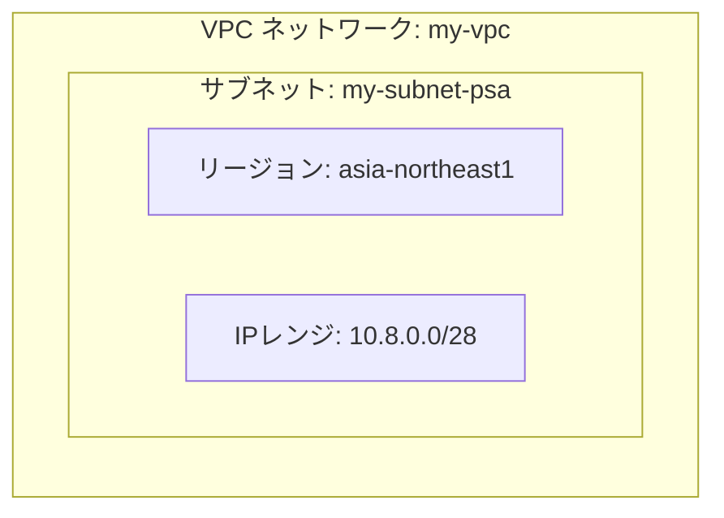

プロジェクト、リージョン、ゾーンの設定
```bash
export PROJECT_ID=inuverse-test-vpc
export REGION=asia-northeast1
export ZONE=asia-northeast1-a

gcloud config set project $PROJECT_ID
gcloud config set compute/region $REGION
gcloud config set compute/zone $ZONE
```

```
WARNING: Your active project does not match the quota project in your local Application Default Credentials file. This might result in unexpected quota issues.

To update your Application Default Credentials quota project, use the `gcloud auth application-default set-quota-project` command.
Updated property [core/project].
API [compute.googleapis.com] not enabled on project [inuverse-test-vpc]. Would you like to enable
and retry (this will take a few minutes)? (y/N)?  y

Enabling service [compute.googleapis.com] on project [inuverse-test-vpc]...
Operation "operations/acf.p2-316032311402-4e1bade8-c4f8-4704-8ae4-e13bab3b4ce9" finished successfully.
Updated property [compute/region].
Updated property [compute/zone].
```


プロジェクト、リージョン、ゾーンの確認
```
gcloud config list project &&
gcloud config list compute/region &&
gcloud config list compute/zone
```

```
[core]
project = inuverse-test-vpc

Your active configuration is: [default]
[compute]
region = asia-northeast1

Your active configuration is: [default]
[compute]
zone = asia-northeast1-a

Your active configuration is: [default]
```


必要なAPIを有効化
```
gcloud services enable \
  compute.googleapis.com \
  vpcaccess.googleapis.com \
  storage.googleapis.com
```

```
Operation "operations/acf.p2-316032311402-4c08db9e-a845-4ac1-952d-7386e1d90e61" finished successfully.
```


# 1. VPCネットワークとサブネットの作成

```bash
gcloud compute networks create my-vpc \
  --subnet-mode=custom
```

```
Created [https://www.googleapis.com/compute/v1/projects/inuverse-test-vpc/global/networks/my-vpc].
NAME    SUBNET_MODE  BGP_ROUTING_MODE  IPV4_RANGE  GATEWAY_IPV4  INTERNAL_IPV6_RANGE
my-vpc  CUSTOM       REGIONAL

Instances on this network will not be reachable until firewall rules
are created. As an example, you can allow all internal traffic between
instances as well as SSH, RDP, and ICMP by running:

$ gcloud compute firewall-rules create <FIREWALL_NAME> --network my-vpc --allow tcp,udp,icmp --source-ranges <IP_RANGE>
$ gcloud compute firewall-rules create <FIREWALL_NAME> --network my-vpc --allow tcp:22,tcp:3389,icmp
```

![[スクリーンショット 2025-07-11 18.13.10.png]]

![[スクリーンショット 2025-07-11 18.15.16.png]]

```bash
gcloud compute networks subnets create my-subnet-psa \
  --network=my-vpc \
  --region=$REGION \
  --range=10.8.0.0/28
```

```
Created [https://www.googleapis.com/compute/v1/projects/inuverse-test-vpc/regions/asia-northeast1/subnetworks/my-subnet-psa].
NAME           REGION           NETWORK  RANGE        STACK_TYPE  IPV6_ACCESS_TYPE  INTERNAL_IPV6_PREFIX  EXTERNAL_IPV6_PREFIX
my-subnet-psa  asia-northeast1  my-vpc   10.8.0.0/28  IPV4_ONLY
```

![[スクリーンショット 2025-07-11 18.44.04.png]]

```bash
gcloud compute networks list &&
gcloud compute networks subnets list | grep my-subnet-psa
```

```
NAME     SUBNET_MODE  BGP_ROUTING_MODE  IPV4_RANGE  GATEWAY_IPV4  INTERNAL_IPV6_RANGE
default  AUTO         REGIONAL
my-vpc   CUSTOM       REGIONAL
my-subnet-psa  asia-northeast1          my-vpc   10.8.0.0/28    IPV4_ONLY
```



# 2. Private Services Access (PSA) コネクタの作成

```
gcloud compute networks vpc-access connectors create psa-connector \
  --network=my-vpc \
  --region=$REGION \
  --range=10.8.0.16/28
```

```
Create request issued for: [psa-connector]
Waiting for operation [projects/inuverse-test-vpc/locations/asia-northeast1/operations/d6278813-88f3-42bf-b53e-7156cda2273a] to complete...faile
d.
ERROR: (gcloud.compute.networks.vpc-access.connectors.create) {
  "code": 9,
  "message": "Operation failed: Insufficient CPU quota in region."
}
```