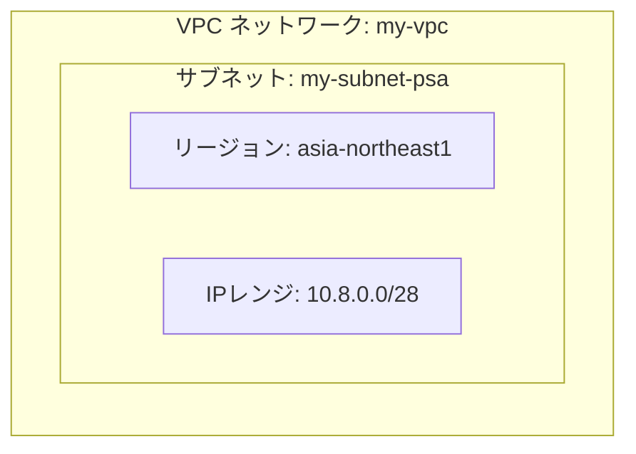
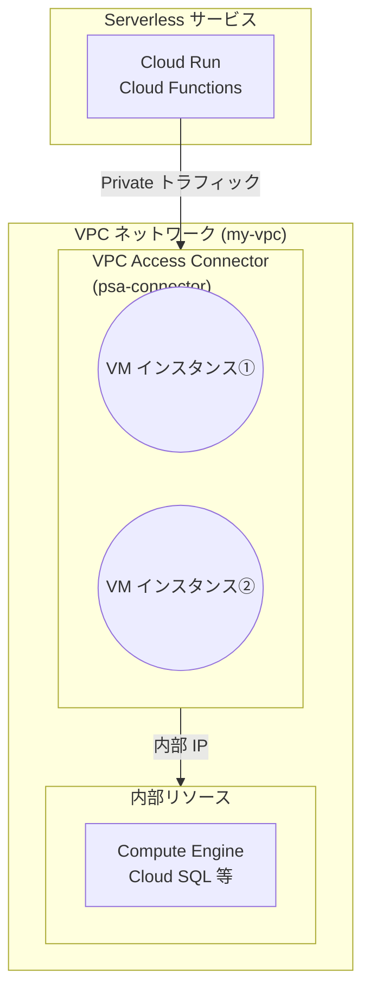
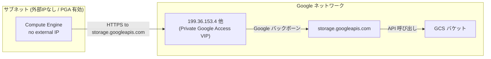
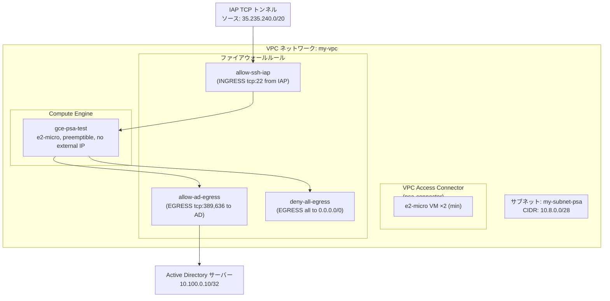
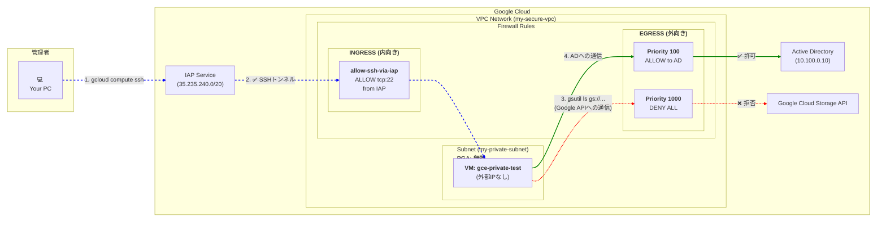

プロジェクト、リージョン、ゾーンの設定
```bash
export PROJECT_ID=inuverse-test-vpc
export REGION=asia-northeast1
export ZONE=asia-northeast1-a

gcloud config set project $PROJECT_ID
gcloud config set compute/region $REGION
gcloud config set compute/zone $ZONE
```

```
WARNING: Your active project does not match the quota project in your local Application Default Credentials file. This might result in unexpected quota issues.

To update your Application Default Credentials quota project, use the `gcloud auth application-default set-quota-project` command.
Updated property [core/project].
API [compute.googleapis.com] not enabled on project [inuverse-test-vpc]. Would you like to enable
and retry (this will take a few minutes)? (y/N)?  y

Enabling service [compute.googleapis.com] on project [inuverse-test-vpc]...
Operation "operations/acf.p2-316032311402-4e1bade8-c4f8-4704-8ae4-e13bab3b4ce9" finished successfully.
Updated property [compute/region].
Updated property [compute/zone].
```


プロジェクト、リージョン、ゾーンの確認
```
gcloud config list project &&
gcloud config list compute/region &&
gcloud config list compute/zone
```

```
[core]
project = inuverse-test-vpc

Your active configuration is: [default]
[compute]
region = asia-northeast1

Your active configuration is: [default]
[compute]
zone = asia-northeast1-a

Your active configuration is: [default]
```


必要なAPIを有効化
```
gcloud services enable \
  compute.googleapis.com \
  vpcaccess.googleapis.com \
  storage.googleapis.com
```

```
Operation "operations/acf.p2-316032311402-4c08db9e-a845-4ac1-952d-7386e1d90e61" finished successfully.
```


# 1. VPCネットワークとサブネットの作成

```bash
gcloud compute networks create my-vpc \
  --subnet-mode=custom
```

```
Created [https://www.googleapis.com/compute/v1/projects/inuverse-test-vpc/global/networks/my-vpc].
NAME    SUBNET_MODE  BGP_ROUTING_MODE  IPV4_RANGE  GATEWAY_IPV4  INTERNAL_IPV6_RANGE
my-vpc  CUSTOM       REGIONAL

Instances on this network will not be reachable until firewall rules
are created. As an example, you can allow all internal traffic between
instances as well as SSH, RDP, and ICMP by running:

$ gcloud compute firewall-rules create <FIREWALL_NAME> --network my-vpc --allow tcp,udp,icmp --source-ranges <IP_RANGE>
$ gcloud compute firewall-rules create <FIREWALL_NAME> --network my-vpc --allow tcp:22,tcp:3389,icmp
```

![[スクリーンショット 2025-07-11 18.13.10.png]]

![[スクリーンショット 2025-07-11 18.15.16.png]]

```bash
gcloud compute networks subnets create my-subnet-psa \
  --network=my-vpc \
  --region=$REGION \
  --range=10.8.0.0/28
```

```
Created [https://www.googleapis.com/compute/v1/projects/inuverse-test-vpc/regions/asia-northeast1/subnetworks/my-subnet-psa].
NAME           REGION           NETWORK  RANGE        STACK_TYPE  IPV6_ACCESS_TYPE  INTERNAL_IPV6_PREFIX  EXTERNAL_IPV6_PREFIX
my-subnet-psa  asia-northeast1  my-vpc   10.8.0.0/28  IPV4_ONLY
```

![[スクリーンショット 2025-07-11 18.44.04.png]]

```bash
gcloud compute networks list &&
gcloud compute networks subnets list | grep my-subnet-psa
```

```
NAME     SUBNET_MODE  BGP_ROUTING_MODE  IPV4_RANGE  GATEWAY_IPV4  INTERNAL_IPV6_RANGE
default  AUTO         REGIONAL
my-vpc   CUSTOM       REGIONAL
my-subnet-psa  asia-northeast1          my-vpc   10.8.0.0/28    IPV4_ONLY
```



# 2. Private Services Access (PSA) コネクタの作成

```
gcloud compute networks vpc-access connectors create psa-connector \
  --network=my-vpc \
  --region=$REGION \
  --range=10.8.0.16/28 \
  --machine-type=e2-micro \
  --min-instances=2 \
  --max-instances=3
```

```
Create request issued for: [psa-connector]
Waiting for operation [projects/inuverse-test-vpc/locations/asia-northeast1/operations/d6278813-88f3-42bf-b53e-7156cda2273a] to complete...faile
d.
ERROR: (gcloud.compute.networks.vpc-access.connectors.create) {
  "code": 9,
  "message": "Operation failed: Insufficient CPU quota in region."
}
```

最小インスタンス数をケチると、高可用性のために最低限2つだと怒ってくる
```
ERROR: (gcloud.compute.networks.vpc-access.connectors.create) INVALID_ARGUMENT: The minimum amount of instances underlying the connector must be at least 2.
```

最大インスタンス数は最小インスタンス数よりも大きくしろって
```
ERROR: (gcloud.compute.networks.vpc-access.connectors.create) INVALID_ARGUMENT: The specified minimum instances value must be less than the specified maximum instances value.
```

OKなのでチェック！
```
gcloud compute networks vpc-access connectors describe psa-connector \
  --region=$REGION
```

```
ipCidrRange: 10.8.0.16/28
machineType: e2-micro
maxInstances: 3
maxThroughput: 300
minInstances: 2
minThroughput: 200
name: projects/inuverse-test-vpc/locations/asia-northeast1/connectors/psa-connector
network: my-vpc
state: READY
```





# ファイアウォールルールの作成

## 3-1. Active Directory 用 ALLOW egress

```
gcloud compute firewall-rules create allow-ad-egress \
  --network=my-vpc \
  --direction=EGRESS \
  --action=ALLOW \
  --rules=tcp:389,tcp:636 \
  --destination-ranges=10.100.0.10/32 \
  --priority=100
```

```
Creating firewall...⠹Created [https://www.googleapis.com/compute/v1/projects/inuverse-test-vpc/global/firewalls/allow-ad-egress].
Creating firewall...done.
NAME             NETWORK  DIRECTION  PRIORITY  ALLOW            DENY  DISABLED
allow-ad-egress  my-vpc   EGRESS     100       tcp:389,tcp:636        False
```

- **TCP/IP のポート番号**    
    - ネットワーク上で「どのアプリケーション（サービス）宛か」を識別するための番号です。
    - 0～65535 の範囲があり、IANA（Internet Assigned Numbers Authority）が主要サービス向けに公式割当を管理しています。
- **389 番／636 番**
    - **389 TCP**：LDAP（Lightweight Directory Access Protocol）の標準ポート番号
    - **636 TCP**：LDAP over SSL/TLS（LDAPS）の標準ポート番号
- **なぜ指定するか**
    - ファイアウォールでは「どのプロトコル（TCP/UDP）・どのポート番号を通すか」を細かく制御できるため、
        - `tcp:389` → LDAP 通信のみ許可
        - `tcp:636` → 暗号化された LDAP 通信（LDAPS）のみ許可
    - これにより、AD（Active Directory）以外の TCP トラフィックが誤って通らないようにできます。


**2. 宛先レンジ (destination-ranges) ─ `10.100.0.10/32` の意味**

- **CIDR 表記**（Classless Inter-Domain Routing）    
    - `IPアドレス/プレフィックス長` という形式でネットワークやホストの範囲を表します。
    - 例：`192.168.0.0/24` → IP が `192.168.0.0 ～ 192.168.0.255` の 256 アドレスをカバー
- **`/32` の意味**
    - プレフィックス長 32 ビット＝すべてのビットをマスク（ネットワーク部）として指定
    - **ホスト部が 0 ビット** になるため、まさに「その 1 つの IP アドレスのみ」を指します。
    - `10.100.0.10/32` → **IP アドレス `10.100.0.10` のみ** が宛先になるトラフィックを対象にする、という意味
- **なぜピンポイント指定するか**
    - VPC 内の Active Directory サーバーが持つ “固定の内部 IP” に絞って許可／拒否を設定することで、
        - 他の内部サーバーや外部への通信が誤って通らない
        - セキュリティ境界を明確化できる
## 3-2. その他すべてを DENY egress

```bash
gcloud compute firewall-rules create deny-all-egress \
  --network=my-vpc \
  --direction=EGRESS \
  --action=DENY \
  --rules=all \
  --destination-ranges=0.0.0.0/0 \
  --priority=1000
```

```
Creating firewall...⠹Created [https://www.googleapis.com/compute/v1/projects/inuverse-test-vpc/global/firewalls/deny-all-egress].
Creating firewall...done.
NAME             NETWORK  DIRECTION  PRIORITY  ALLOW  DENY  DISABLED
deny-all-egress  my-vpc   EGRESS     1000             all   False
```

IAPトンネル用ファイアウォールを許可する
```bash
gcloud compute firewall-rules create allow-ssh-iap \
  --network=my-vpc \
  --direction=INGRESS \
  --action=ALLOW \
  --rules=tcp:22 \
  --source-ranges=35.235.240.0/20 \
  --description="Allow SSH via IAP"
```

```
Creating firewall...⠹Created [https://www.googleapis.com/compute/v1/projects/inuverse-test-vpc/global/firewalls/allow-ssh-iap].
Creating firewall...done.
NAME           NETWORK  DIRECTION  PRIORITY  ALLOW   DENY  DISABLED
allow-ssh-iap  my-vpc   INGRESS    1000      tcp:22        False
```

確認
```bash
gcloud compute firewall-rules list
```

```
NAME                    NETWORK  DIRECTION  PRIORITY  ALLOW                         DENY  DISABLED
allow-ad-egress         my-vpc   EGRESS     100       tcp:389,tcp:636                     False
allow-ssh-iap           my-vpc   INGRESS    1000      tcp:22                              False
default-allow-icmp      default  INGRESS    65534     icmp                                False
default-allow-internal  default  INGRESS    65534     tcp:0-65535,udp:0-65535,icmp        False
default-allow-rdp       default  INGRESS    65534     tcp:3389                            False
default-allow-ssh       default  INGRESS    65534     tcp:22                              False
deny-all-egress         my-vpc   EGRESS     1000                                    all   False

To show all fields of the firewall, please show in JSON format: --format=json
To show all fields in table format, please see the examples in --help.
```


GUIでは
VPC > ファイアフォール
![[スクリーンショット 2025-07-11 23.18.55.png]]


# 4. Compute Engine インスタンスの作成
```bash
gcloud compute instances create gce-psa-test \
  --zone=$ZONE \
  --machine-type=e2-micro \
  --preemptible \
  --no-address \
  --network=my-vpc \
  --subnet=my-subnet-psa \
  --image-family=cos-stable \
  --image-project=cos-cloud \
  --boot-disk-size=10GB \
  --boot-disk-type=pd-standard \
  --metadata=enable-os-login=TRUE
```

```
WARNING: You have selected a disk size of under [200GB]. This may result in poor I/O performance. For more information, see: https://developers.google.com/compute/docs/disks#performance.
Created [https://www.googleapis.com/compute/v1/projects/inuverse-test-vpc/zones/asia-northeast1-a/instances/gce-psa-test].
NAME          ZONE               MACHINE_TYPE  PREEMPTIBLE  INTERNAL_IP  EXTERNAL_IP  STATUS
gce-psa-test  asia-northeast1-a  e2-micro      true         10.8.0.2                  RUNNING
```


チェック
```bash
gcloud compute instances list
```

```
NAME          ZONE               MACHINE_TYPE  PREEMPTIBLE  INTERNAL_IP  EXTERNAL_IP  STATUS
gce-psa-test  asia-northeast1-a  e2-micro      true         10.8.0.2                  RUNNING
```


# 4.5 GCS

```
gsutil mb -l $REGION gs://my-private-bucket/
```

```
Creating gs://my-private-bucket/...
ServiceException: 409 A Cloud Storage bucket named 'my-private-bucket' already exists. Try another name. Bucket names must be globally unique across all Google Cloud projects, including those outside of your organization.
```
名前が被りました

あらためて、
```
gsutil mb -l $REGION gs://inuverse-test-vpc/
```

```
Creating gs://inuverse-test-vpc/...
```

PGA (Private Google Access)
```
gcloud compute networks subnets update my-subnet-psa \
  --region=$REGION \
  --enable-private-ip-google-access
```

```
Updated [https://www.googleapis.com/compute/v1/projects/inuverse-test-vpc/regions/asia-northeast1/subnetworks/my-subnet-psa].
```





# 5. 動作確認

SSH
```
gcloud compute ssh gce-psa-test
```





その他

キャッシュ
```
gcloud compute instances stop gce-psa-test --zone=$ZONE
gcloud compute instances start gce-psa-test --zone=$ZONE
```


=====================================


```mermaid
flowchart LR
    %% サブグラフ定義
    subgraph VPC ["VPC Network (my-secure-vpc)"]
        subgraph Subnet ["Subnet (限定公開のGoogleアクセス有効)"]
            VM["VM: gce-private-test<br/>(外部IPなし)"]
        end
        subgraph Firewall ["Egress Firewall"]
            FW_ALLOW["<b>Priority 100</b><br/>ALLOW to AD"]
            FW_DENY["<b>Priority 1000</b><br/>DENY ALL"]
        end
    end

    subgraph External ["外部の宛先"]
        AD["Active Directory<br/>(10.100.0.10)"]
        GCS["Google Cloud Storage<br/>(Public IP)"]
    end

    %% エッジ定義（ラベルを上部に配置）
    VM -->|ADへの通信 (tcp:389)| FW_ALLOW
    FW_ALLOW -->|✅ 許可 (OK)| AD

    VM -->|GCSへの通信 (tcp:443)<br/>gsutil ls gs://...| FW_DENY
    FW_DENY -->|❌ 拒否 (BLOCK!)| GCS

    %% エッジのスタイル指定（0: 最初のエッジ, 2: 3番目のエッジ）
    linkStyle 0 stroke:green,stroke-width:2px;
    linkStyle 2 stroke:red,stroke-width:2px,stroke-dasharray:5,5;
```


