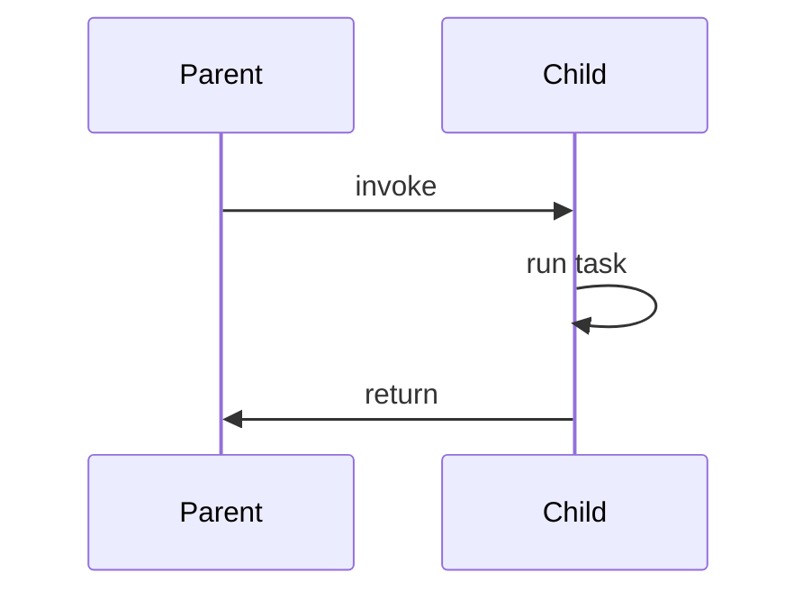

# 要約
- 

# 重要ポイント・キーアイデア
- 

# 引用メモ

p3
> 一般用語でいうオブザーバビリティとは、外部出力の観測から内部状態をどの程度推測できるかを測るシステムの品質です。これは1960年に、Rudolf E. Ka'lma'nが制御システムの理論の概念として初めて説明したもので、論文「On the general theory of control system」の一部として、...（略）

On the general theory of control systemはOpen Source
https://www.sciencedirect.com/science/article/pii/S1474667017700948

中身はかなり数学を使用している。定義は
> Let $X^\ast$ be the dual vector space of the state space X, i.e. the space of all linear function on $X$. An element $\mathbf{z}^\ast$ or $\mathbf{x}^\ast$ of $X^\ast$ is called a *costate.*
> 
> 	A costate $\mathbf{z}^\ast$ of a plant is said to be 'observable' if its exact value $[\mathbf{z}^\ast, \mathbf{x}]$ at any state $\mathbf{x}$ at time $0$ can be determined from measurements of the output signal $y_1(t) = [\mathbf{b}^\ast,\mathbf{\phi}(t; \mathbf{x}, 0)]$ over the finite integral $0 \geq t \geq t_2$. The time $t_2$ will depend in general on $\mathbf{z}^\ast$. If every costate is observable, we say that the plant is 'completely observable'.

ちょっと何を言っているか分からないが、わかる範囲で読み解くと、
$X^\ast$という

p5
>平均復旧時間　(MTTRec: Mean Time to Recovery)と平均解決時間 (MTTRes: Mean Time to Resoluction)を区別することが重要です。

> - 平均復旧時間　(MTTRec)：障害発生開始から、システムが通常動作に戻るまでの時間
> - 平均解決時間　（MTTRes）：障害発生開始から、根本原因が特定され、修正がデプロイされるまでの時間

＜図を添付。一番わかりやすい＞

p7
>標準化されたテレメトリー規約を使用してデバッグコンテキストを即座に提供することが、オブザーバビリティの主な目的です。複数のサービスから出力されるメトリクスログ、トレースなどのさまざまなシグナルから以上を自動的に相関させることで、単一かつ包括てきなデバッグ体験を実現します。

さまざまんシグナルを相関させる。相関係数の概念や統計量の概念が重要になりそう。
CPUやリクエスト数をベクトルとして扱って、相関係数？どうやるのか気になる。

p8
> その結果、システム運用の複雑さや認知負荷が指数関数的に増加しました。

本当に指数関数か？グラフ理論からわかる？

p8
> アラートスパムは現実の問題となり、平均解決時間に大きな影響を及ぼし、対処しきれないアラートの中にビジネスクリティカルなアラートが埋もれてしまい、重要なリスクに気付かなくなる可能性が高まりました。

アラートやログ設計が大事ってこと？具体的にどんなクライテリアがあるのか今後注目。

p9
> 認知負荷には限界があり、特に分散システムではその傾向が強まります。

p9
> そこで役立つのがオブザーバビリティであり、そのもっとも重要な２つの機能は**コンテキスト**と**相関関係**です。

ほう。つまり、オブザーバビリティによる解析は認知負荷を伴いづらい。いくらか軽減できるということか。認知負荷が高くても数値データの解析であれば深層学習に丸投げできそう。数理的に理論も作れそうだね。

p11
> これは単純なシナリオですが、何百ものサービスがあり、１つのトランザクションに対して何十ものサービスを関連させるような大規模な分散システムでこれを考えてください。そのようなシナリオをデバッグするためには、**コンテキスト**が必要です。

p12
> テイルレイテンシー

パーセンタイル応答時間が大きいやつ。p95とp99。テイルは文字通り尾。これは分布の尾瀬を表している。

p12
> テレメトリーノイズ

p13
> 技術的に可能な限りテレメトリーデータを保存しないというコンセプトは、多くの人にとって直感に反するように聞こえるかもしれません。

どのようなテレメトリー、どのようなメトリクスを残すかを設計しないと、ゴミデータ95%になってしまう。

p14
> オブザーバビリティシステムの主な焦点は、最新のテレメトリーデータを迅速に取得し、デバッグを容易にするための洞察を自動的に引き出すこと。

これはMMTKを早くしないといけないことに対応する。リアルタイム性。ゴミデータが多いと、テレメトリーバックエンドに負荷がかかるため、p13で言っていたことを思い出せ。

p18
> オブザーバビリティを効果的にするためには、開発者がシステムを計装しデバッグする際に、適切な種類のシグナルを適切な目的で使用することを学ぶ必要があります。たとえば、SLOの監視とアラートには、アプリケーションログよりも低粒度のメトリクスを使ってダッシュボードやアラートを構成する方が信頼性が高まります。

は？なんで？？？

p21, 22
サービスのレイテンシのような時系列データが同じパターンになっていることを突き止める。同じパターンを定量的に表したい。相関関係を見たい。

p23
>  それが、OpenTracing（CNCFプロジェクト）とOpenCensus（Googleオープンソースコミュニティプロジェクト）です。2019年5月、（中略）OpenTelemetryを立ち上げました。

テレメトリー標準化の動きは前々からあり、それを本格始動させたって感じかな？

p33
> シグナルとは、特定の観測領域におけるテレメトリの一種です。メトリクスやログのようにソフトウェア業界で長年使われてきたシグナルもあれば、トレースやバゲッジのように比較的新たにオブザーバビリティツールキットに追加されてものもあります。

$$
	trace, baggage, metrics, log \subset signal \subset telemetry
$$
ってこと？いや、シグナルには属しないメトリクスやログもあるのかな？この特定観測領域というのが気になる。

p38
トレースの節に突入したが、トレースの定義について書かれていないんだが？
は？定義しろや。
文脈から読み取るに
> 個々のトランザクションに対する高粒度の洞察を得ることで、複数のレイヤーによって分離されたシステム間のリグレッションを自動的に相関させられます。これが、トレースが本当に優れている点です。

がトレースについて書かれているが、これは断じて定義と呼べる代物ではない。トレースの実態がなんなのかが分からない（システムなのか、コードなのか、なんなのか）

p38
> 共通の定義要素は、単一の共通操作の一部であるイベントの集合が、それらの間の因果関係によって接続されているという概念です。OpenTelemetryではん、そのようなイベントを**スパン**と呼びます。

おい、ふざけるな。文が変わった瞬間に実体がずれているぞ。
スパンは「概念」なのか「イベント」なのか。
（で、おそらく実務的にはイベントが正解）

p39
> スパンはトランザクション内の単一の操作を表します。スパンは与えられた操作に費やされた時間を測定する個々の構造化ログと考えられ、他のスパンにリンクできる一連の標準属性が付加されています。

スパンは操作を表すものであり、現代において具体的な表現方法が構造化ログ。
テレメトリーという抽象的な指標があり、われわれは構造化ログという表現で近くできる。群と群の表現論のような関係に見える。まあ、なんでもかんでもアナロジーを考えればいいってもんでもないか。

p39
>メトリクスは、もっとも広く使用されているメトリクスの１つです。メトリクスを利用することで、トレースやログよりも安定した方法で、さまざまな集約関数を使用して、測定値を経時的に監視できます。

「経時的」は常用的に私は使用しない。
https://www.weblio.jp/content/%E7%B5%8C%E6%99%82%E7%9A%84#google_vignette

定義しないね。私はSoftware開発におけるObservabilityの三本の柱と言われている「トレース」「メトリクス」「ログ」の明確な定義の違いを知りたいのですよ。

p40
> 図3-3では、リクエストレイテンシーの生の測定値が個別に記録され、その後、ヒストグラムと合計の両方のビューを表示する様子を示しています。

もしかして、今やっている俺の負荷検証で生成したいメトリクス、OpenTelemetryで出せるってこと？どうやって？Google Cloud Platform上でできるか？いや、できてほしいんだけれど、対応するメトリクスが分からないので要調査。

p41
> ログは、他のどのタイプのテレメトリーシグナルよりも長い間使われてきました。

p42
> ログを生成するのは簡単ですが、分散システム内、特に何百や何千ものサービスれ振りががログを生成する場合、コンテキストの欠如によって、従来のログを使ったデバッグの価値が大幅に低下します。

p90
> （中略）
> この構造化されたデータの単位をスパンと呼び、１つの分散トランザクションに属するすべての操作をリンクする論理的な概念をトレースと呼びます。

トレースが包括的な単位で、スパンは構造化されたデータ単位。関数レベル。

リグレッション（regression）：回帰、後戻り、後退
linear regression

p93
>OpenTelemtryインスタンスはGlobalOpenTelemetry,get()から取得できるものの、依存性注入 (Dependency Injection)などの方法を使って計装クラスにインスタンスを敵将することが推奨されます。

p95
>スパンを作成する際に考慮すべき重要な側面の１つは粒度です。スパンは、システムの健全性を評価する際に統計的に意味のある作業単位で表現すべきです。

統計的に意味のある単位とは、どのように識別できるのか？
なにかよいcriteriaはないか？
親スパンと子スパンの持続時間の比が1%未満ならあまり意味がない。スパン収集のオーバーヘッドを生じさせるため、パフォーマンスにも影響あるかも。
親スパンと子スパンの持続時間の関係はどうあるべき？10%？20%?
おそらく%で切り分けるのは、良い方法ではないく、もっとメタ的な要素から切り分けられるべきである。その原理は？数学的に、演繹的に、適切なスパンを切り分けるためには？

p103
>親スパンと子スパンの関係は因果関係と依存関係であるべきです。親スパンで記述した操作が子スパンで記述した操作を引き起こし、親スパンはその結果にある程度依存します。

つまりシーケンス図的には

の関係は満たしていて欲しい。
# 感想・考察
- 

# アクション・次のステップ
- 例：関連ノートにリンクする  
- 例：〇〇について調べる

# 🔗 関連ノート
- [[別のノート名]]
