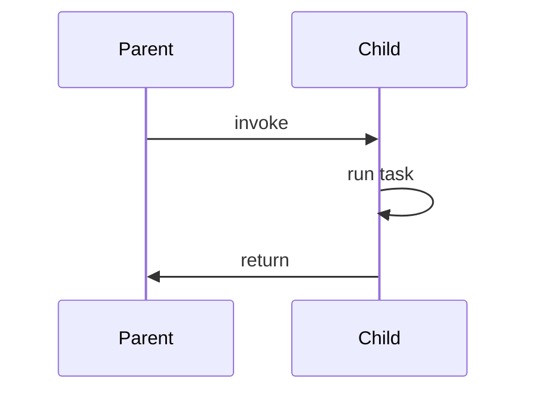

# 要約
- 

# 重要ポイント・キーアイデア
- 

# 引用メモ
p90
> （中略）
> この構造化されたデータの単位をスパンと呼び、１つの分散トランザクションに属するすべての操作をリンクする論理的な概念をトレースと呼びます。

トレースが包括的な単位で、スパンは構造化されたデータ単位。関数レベル。

リグレッション（regression）：回帰、後戻り、後退
linear regression

p93
>OpenTelemtryインスタンスはGlobalOpenTelemetry,get()から取得できるものの、依存性注入 (Dependency Injection)などの方法を使って計装クラスにインスタンスを敵将することが推奨されます。

p95
>スパンを作成する際に考慮すべき重要な側面の１つは粒度です。スパンは、システムの健全性を評価する際に統計的に意味のある作業単位で表現すべきです。

統計的に意味のある単位とは、どのように識別できるのか？
なにかよいcriteriaはないか？
親スパンと子スパンの持続時間の比が1%未満ならあまり意味がない。スパン収集のオーバーヘッドを生じさせるため、パフォーマンスにも影響あるかも。
親スパンと子スパンの持続時間の関係はどうあるべき？10%？20%?
おそらく%で切り分けるのは、良い方法ではないく、もっとメタ的な要素から切り分けられるべきである。その原理は？数学的に、演繹的に、適切なスパンを切り分けるためには？

p103
>親スパンと子スパンの関係は因果関係と依存関係であるべきです。親スパンで記述した操作が子スパンで記述した操作を引き起こし、親スパンはその結果にある程度依存します。

つまりシーケンス図的には

の関係は満たしていて欲しい。
# 感想・考察
- 

# アクション・次のステップ
- 例：関連ノートにリンクする  
- 例：〇〇について調べる

# 🔗 関連ノート
- [[別のノート名]]
