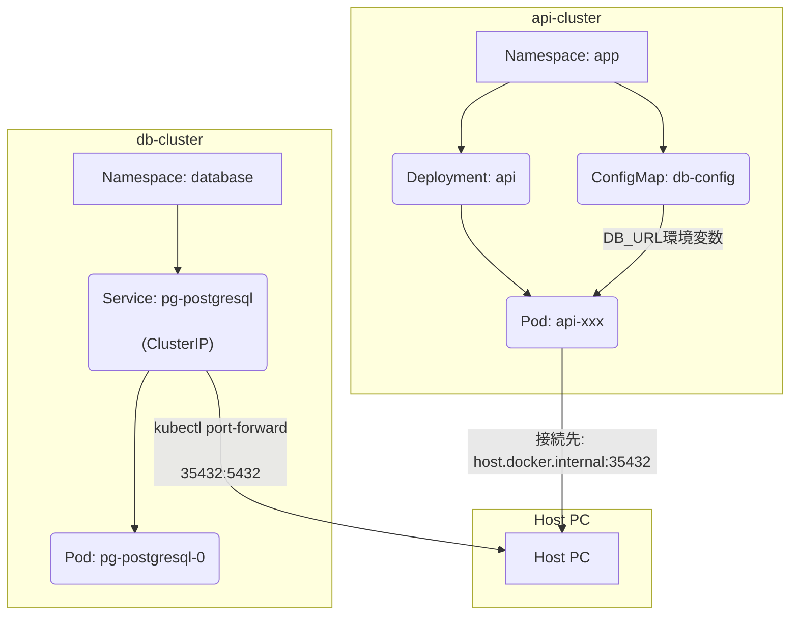

（このinboxノートは*Kubernates hands on 第5回*の内容です）
## PostgreSQL接続エラーのトラブルシューティングプロセス

### 1. 問題の発生と初期調査
ユーザーから以下の`kubectl`コマンドがエラーになるという報告を受けました。
  
```bash

kubectl -n app exec -it $(kubectl -n app get pod -o name | head -1) -- \
apk add postgresql-client && \
psql "$DB_URL" -c "SELECT 1;"
```

  エラーの原因を特定するため、以下の初期調査を行いました。
  
* **`README.md`の確認**: `5.md`が見当たらないため、プロジェクトの`README.md`を読み込み、環境構築の基本的な手順を把握しました。

* **`kubectl`コンテキストの確認**: `kubectl config current-context`を実行したところ、`kind-db-cluster`がアクティブになっており、`api-cluster`に切り替える必要があることが判明しました。

* **`DB_URL`環境変数の確認**: `echo $DB_URL`を実行したところ、`DB_URL`が設定されていないことが判明しました。

* **`db-config` ConfigMapの確認**: `DB_URL`が`db-config` ConfigMapから取得されることを想定し、`kubectl -n app get configmap db-config -o yaml`を実行しましたが、`namespaces "app" not found`というエラーが発生しました。

これらの調査から、`app`名前空間が存在せず、環境が適切にセットアップされていないことが示唆されました。


### 2. 環境のセットアップ (`setup.sh`の実行)

`README.md`の指示に従い、環境をセットアップするために`setup.sh`スクリプトを実行する必要があると判断しました。

* `chmod +x setup.sh`で実行権限を付与し、`./setup.sh`を実行しました。

* `setup.sh`の実行により、`kind-db-cluster`と`kind-api-cluster`が作成され、`kind-api-cluster`内に`app`名前空間と`db-config` ConfigMapが作成されました。

### 3. `kubectl`コンテキストと`DB_URL`の設定

`setup.sh`の完了後、以下の手順で環境を整えました。

* `kubectl config use-context kind-api-cluster`を実行し、コンテキストを`api-cluster`に切り替えました。

* `export DB_URL=$(kubectl -n app get configmap db-config -o jsonpath='{.data.DB_URL}')`を実行し、`db-config`から`DB_URL`を取得して環境変数に設定しました。

### 4. `api` Podのデプロイ

再度元のコマンドを実行したところ、`error: pod, type/name or --filename must be specified`というエラーが発生しました。これは、`app`名前空間にPodが存在しないため、`$(kubectl -n app get pod -o name | head -1)`が何も返さないことが原因でした。

`5.md`の資料を確認したところ、「ConfigMap / Secret で接続情報を注入」セクションに`api` DeploymentのYAML定義があることを発見しました。このDeploymentを`app`名前空間にデプロイすることで、`psql`コマンドを実行するPodが起動すると判断しました。

* 当初、`cat <<EOF | kubectl apply -f -`で直接YAMLを適用しようとしましたが、構文エラーが複数回発生しました。

* 安定した適用のため、YAML内容を`api-deployment.yaml`というファイルに書き出し、`kubectl apply -f /Users/kodamaitsuki/shinise/shinise-training/file/5/api-deployment.yaml`で適用しました。

* これにより、`deployment.apps/api created`と表示され、`api` Deploymentが正常に作成されました。

### 5. `kubectl exec`コマンドの修正と再試行

  `api` Podが起動した後、再度元のコマンドを実行しましたが、以下のエラーに遭遇しました。

* **`container not found ("api")`**: Podがまだ完全に準備できていない一時的なエラーでした。`kubectl -n app get pods -o wide`でPodが`Running`状態であることを確認しました。

* **`apk: executable file not found in $PATH`**: `api` Podのベースイメージが`nginx`（Debianベース）なので、`apk`パッケージマネージャーが存在しないことが原因でした。Debianベースのイメージでは`apt-get`を使用する必要があります。

* **`Unable to use a TTY`**: `kubectl exec`の`-it`フラグがインタラクティブなTTYを要求するため、非インタラクティブな実行環境ではエラーになることが判明しました。

* **`psql: error: connection to server on socket ... failed`**: `DB_URL`環境変数がPod内のシェルで正しく展開されていないことが原因でした。

これらの問題を解決するため、コマンドを以下のように修正しました。
```bash
POD_NAME=$(kubectl -n app get pod -o name | head -1) && \
kubectl -n app exec $POD_NAME -- bash -c 'apt-get update > /dev/null && apt-get install -y postgresql-client > /dev/null && psql "$DB_URL" -c "SELECT 1;"'
```

* `apk add`を`apt-get install`に変更。

* `-it`フラグを削除。

* `psql`コマンドと`DB_URL`の展開を`bash -c '...'`で囲むことで、Pod内のシェルで正しく解釈されるようにしました。

### 6. `Connection refused`エラーと`port-forward`の実行

修正したコマンドで再試行したところ、`psql: error: connection to server at "host.docker.internal" (0.250.250.254), port 35432 failed: Connection refused`というエラーが発生しました。

これは、`api-cluster`から`db-cluster`のPostgreSQLへの接続経路が確立されていないことが原因でした。`5.md`の資料には、`port-forward`を使用して`db-cluster`のPostgreSQLサービスをホストPCの`35432`ポートにトンネリングする手順が記載されていました。`setup.sh`の実行ログを確認したところ、この`port-forward`コマンドがバックグラウンドで実行されていなかったか、セッションが切れていたことが判明しました。

* `kubectl config use-context kind-db-cluster`で`db-cluster`にコンテキストを切り替えました。

* `kubectl -n database port-forward svc/pg-postgresql 35432:5432 &`を手動で実行し、PostgreSQLサービスをホストPCにトンネリングしました。

* `kubectl config use-context kind-api-cluster`で`api-cluster`にコンテキストを戻しました。

### 7. 最終的な成功

すべての修正と準備が完了した後、再度修正版のコマンドを実行しました。

```bash
POD_NAME=$(kubectl -n app get pod -o name | head -1) && \
kubectl -n app exec $POD_NAME -- bash -c 'apt-get update > /dev/null && apt-get install -y postgresql-client > /dev/null && psql "$DB_URL" -c "SELECT 1;"'
```

結果として、`?column? 1`という出力が得られ、PostgreSQLへの接続と`SELECT 1;`の実行が正常に成功しました。

---
### 現在のPodとクラスターの構成
現在のPodとクラスターの構成は以下のMermaid図で視覚的に理解できます。
  



  

## 解説

* **Host PC**: あなたのローカルマシンです。

* **db-cluster**: PostgreSQLがデプロイされているKubernetesクラスターです。

* `database`名前空間に`pg-postgresql`サービス（ClusterIPタイプ）があり、それが`pg-postgresql-0`Podを公開しています。

* **api-cluster**: APIアプリケーションがデプロイされているKubernetesクラスターです。

* `app`名前空間に`api` Deploymentがあり、それが`api-xxx`Podを起動しています。

* `db-config` ConfigMapが`app`名前空間にあり、`DB_URL`環境変数を`api-xxx`Podに提供しています。

## 接続フロー

1. `db-cluster`内の`pg-postgresql`サービスは、`kubectl port-forward`コマンドによってHost PCの`35432`ポートにトンネリングされています。

2. `api-cluster`内の`api-xxx`Podは、`DB_URL`環境変数に設定された`host.docker.internal:35432`（Host PCのDocker内部IP）を介して、Host PCに接続します。

3. Host PCは、`port-forward`された接続を通じて、`db-cluster`内のPostgreSQLにトラフィックを転送します。

これにより、`api-cluster`のPodから`db-cluster`のPostgreSQLへ、Host PCを経由して通信が確立されています。

## 🔗 関連
