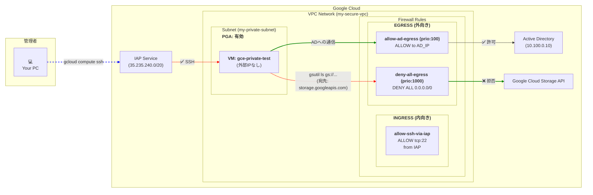
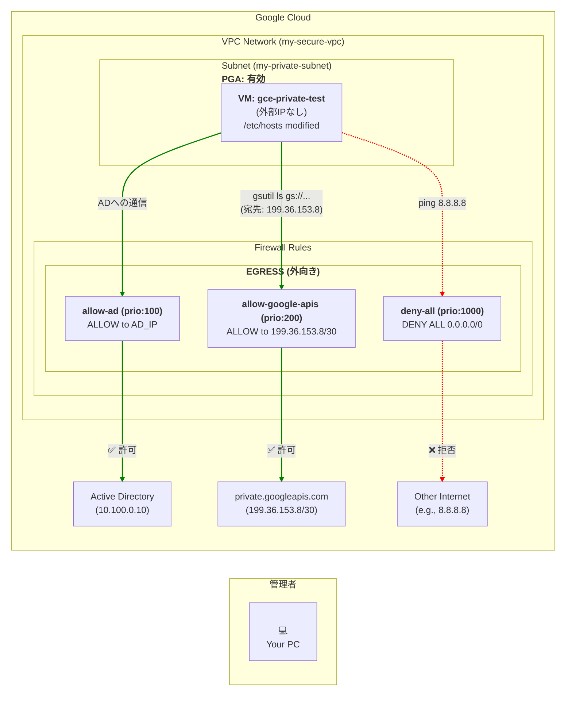

# はじめに
この記事は、Cloud Professional Architect認定試験の学習中に遭遇した、ある技術的な課題について解説する記事です。

Udemyの問題を解く中で、VPCの挙動、特に「外部IPなしVMからのGCSアクセス」と「Egress（下り）通信の厳格な制御」について理解が曖昧な点に気づきました。そこで、実際にハンズオン形式で環境を構築し、動作を検証することにしました。

この2つの要件はそれぞれ基本的ですが、組み合わせることで予期しない「通信タイムアウト」という問題に直面しました。

この記事は、その原因究明と解決までの全記録です。なぜ通信が失敗したのか、そして最終的にどのように解決したのかを、順を追って解説します。

# この記事で扱うシナリオ
本記事で取り上げるのは、以下の2つのGCP認定試験で問われるようなシナリオです。

:::details 問題1：外部IPなしVMからGCSへのアクセス
> あなたは、Compute Engine VMからの公共のインターネットアクセスが許可されていない、高度なセキュリティ環境で作業しています。オンプレミスのファイルサーバーにアクセスするためのVPN接続がまだありません。一方で、特定のソフトウェアをCompute Engineインスタンスにインストールする必要があります。
>
> どのようにソフトウェアをインストールすればよいでしょうか。

**解答方針**: 外部IPアドレスを持たないVMから、インターネットを経由せずにGoogle Cloud内のサービス（この場合はCloud Storage）にアクセスするため、**限定公開のGoogleアクセス（Private Google Access）** を利用します。
:::

:::details 問題2：Egress通信の厳格な制御
> VPC内のすべてのCompute Engineインスタンスは、特定のポートでActive Directoryサーバーに接続できる必要があります。インスタンスからのその他のトラフィックは許可されません。VPCのファイアウォールルールを使用してこれを強制したいと考えています。
>
> ファイアウォールルールはどのように設定すればよいでしょうか。

**解答方針**: VPCファイアウォールルールの**優先度**の概念を使い、特定の送信（Egress）トラフィックのみを許可し、それ以外をすべて拒否するルール（デフォルト拒否）を設定します。具体的には、許可ルールを低い優先度値（例: 100）で、拒否ルールを高い優先度値（例: 1000）で作成します。
:::

---

## Step 1: 目指した構成
上記2つのシナリオを同時に満たす、以下のようなセキュアなVPC環境の構築を目指しました。

- **シナリオ1：外部IPなしVMからGCSへのセキュアなアクセス**
  - VMは外部IPを持たない。
  - インターネットには出ず、Googleの内部ネットワーク経由でCloud Storage上のファイルを取得する。
  - **限定公開のGoogleアクセス (Private Google Access、以下PGA)** を有効化する。

- **シナリオ2：Egressの厳格な制御**
  - VMからの外部への通信は、原則としてすべて拒否する。
  - 例外として、特定のIPアドレス（例: Active Directoryサーバー）への通信のみを許可する。
  - **VPCファイアウォールの優先度付きルール**でこれを実現する。

## Step 2: 謎のタイムアウト地獄
この2つの要件を満たすため、以下の構成を考えました。

1.  PGAを有効化したサブネットを作成。
2.  そのサブネットに外部IPなしのVMを配置。
3.  Egressファイアウォールで「ADへの許可（優先度100）」と「その他すべての拒否（優先度1000）」を設定。

構成図は以下の通りです。



当初、この構成で問題ないと考えていました。しかし、VMの中から`gsutil`コマンドでGCSにアクセスすると、タイムアウトを繰り返してしまいます。

```
INFO 0712 10:07:12.419417 retry_util.py] Retrying request, attempt #1...
```
IAP経由のSSH接続はできるのに、GCSにだけ接続できない。一体なぜでしょうか？

## Step 3: 根本原因の特定と仮説の誤り
試行錯誤の末、根本原因が判明しました。

**原因: PGAのルーティングとEgressファイアウォールの評価順序の相互作用**

1.  **PGAの仕組み**: VMが `storage.googleapis.com` のようなGoogle APIエンドポイントにアクセスしようとすると、PGAは宛先がGoogleの公開IPアドレスであることを検知し、そのパケットをGoogleの内部ネットワークに賢くルーティングします。**しかし、VMから送信されるパケットの宛先IPアドレス自体は、依然としてGoogleの公開IPのままです。**

2.  **Egressファイアウォールの動作**: VMに適用されたEgressファイアウォールは、送信パケットの宛先IPアドレスを見てルールを評価します。今回のケースでは、宛先はGoogleの公開IPであり、これは「その他すべてを拒否」する `deny-all-egress` ルール（優先度1000）に合致してしまいます。

つまり、**VMはGoogleの公開IPに接続しようとし、ファイアウォールがそれを設定通りにブロックする**、という単純かつ致命的な矛盾が発生していたのです。

当初、「PGA用の特別なIP範囲を許可すれば良いのでは？」と考え、`restricted.googleapis.com` (`199.36.153.4/30`) や `private.googleapis.com` (`199.36.153.8/30`) への通信を許可するルールを追加しましたが、状況は改善されませんでした。これらの特別なIPは、DNSレベルで名前解決の設定を変更しない限り、デフォルトでは使用されないためです。

## Step 4: 解決策
この問題を解決するには、以下の2つのステップが**両方とも必要**です。

1.  **ファイアウォールルールの追加**: `deny-all-egress` ルールよりも高い優先度（低い数値）で、PGAが使用する特別なIP範囲 (`private.googleapis.com` 用の `199.36.153.8/30`) へのEgress通信を許可するルールを追加します。
2.  **名前解決の強制**: VMが `storage.googleapis.com` などのドメイン名を、手順1で許可した特別なIPアドレスに解決するように、VM内部の `/etc/hosts` ファイルを編集します。

なぜなら、ファイアウォールで通信経路を許可するだけでは不十分で、VM自身がその経路を使おうとしない（デフォルトの公開IPに名前解決してしまう）からです。この2つはセットで初めて機能します。

### 4.1. ファイアウォールルールの追加
`private.googleapis.com` が使用する `199.36.153.8/30` への通信を許可する、優先度200のファイアウォールルールを作成します。（ADへのルール(100)より優先度は低く、全拒否ルール(1000)より優先度が高い）

```bash
# gcloudコマンドでのルール作成例
gcloud compute firewall-rules create allow-google-apis-egress \
    --network=my-secure-vpc \
    --action=ALLOW \
    --direction=EGRESS \
    --rules=tcp:443 \
    --destination-ranges=199.36.153.8/30 \
    --priority=200
```

### 4.2. VM内部での名前解決の設定
VMにSSHで接続し、GCSのドメインが `private.googleapis.com` のVIP (`199.36.153.8`) に解決されるよう `/etc/hosts` ファイルに追記します。

```bash
# VM内部で実行
echo "199.36.153.8 storage.googleapis.com" | sudo tee -a /etc/hosts
```

この設定により、`gsutil` コマンドは `199.36.153.8` に通信しようとし、その通信は新しく作成した `allow-google-apis-egress` ルールによって許可されます。

## Step 5: 最終的な構成と検証
上記対処を施した結果、最終的な構成は以下の図のようになります。



この状態で検証したところ、期待通りの結果が得られました。

```
--- Verification Summary ---
✅ SUCCESS: GCS bucket is accessible via Private Google Access.
✅ SUCCESS: External internet is NOT accessible due to egress firewall rules.
```
これまで沈黙していた`gsutil`コマンドは正常にGCSバケットの一覧を表示し、同時に `ping 8.8.8.8` は失敗し続け、意図通りインターネットへのアクセスが遮断されていることが確認できました。

## まとめ
今回の経験から得られた教訓は以下の通りです。

- **「デフォルト拒否」のEgressファイアウォールは、PGAの通信もデフォルトでブロックする。**
  - PGAはパケットの宛先IPを魔法のように変えるのではなく、Googleネットワーク内でのルーティングを制御する機能。ファイアウォールはVMから見た宛先IPで評価を行うため、明示的な許可ルールが必要。
- **PGAでGoogle APIにアクセスするには、ファイアウォールとDNSの名前解決の両方の設定が鍵となる。**
  - `private.googleapis.com` (`199.36.153.8/30`) または `restricted.googleapis.com` (`199.36.153.4/30`) を利用するには、ファイアウォールでそのIP範囲を許可した上で、VMがAPIエンドポイントをそのIPに解決できるよう、DNSレコードや `/etc/hosts` の設定が必要。

強力なセキュリティ設定を施す際は、それがGCPのマネージドサービスの暗黙的な動作にどのような影響を与えるかを深く理解することが重要です。

## ハンズオンで再現する

この記事で解説した環境を実際に構築し、検証するためのシェルスクリプトです。

### セットアップ用スクリプト

以下のスクリプトを`setup.sh`として保存し、実行権限を与えて(`chmod +x setup.sh`)から実行してください。`gcloud`コマンドが利用可能な環境が必要です。

```sh
#!/bin/bash
# ==================================
# Section 0: Initial Setup
# ==================================
echo "--- Running Section 0: Initial Setup ---"
export PROJECT_ID=$(gcloud config get-value project)
export REGION="asia-northeast1"
export ZONE="asia-northeast1-a"
export NETWORK_NAME="my-secure-vpc"
export SUBNET_NAME="my-private-subnet"
export INSTANCE_NAME="gce-private-test"
export BUCKET_NAME="${PROJECT_ID}-secure-bucket-$(date +%s)"
gcloud services enable compute.googleapis.com storage.googleapis.com iam.googleapis.com
gcloud config set compute/region $REGION
gcloud config set compute/zone $ZONE

# ==================================
# Section 1: Network and Firewall Setup
# ==================================
echo -e "\n--- Running Section 1: Network and Firewall Setup ---"
gcloud compute networks create $NETWORK_NAME --subnet-mode=custom
gcloud compute networks subnets create $SUBNET_NAME --network=$NETWORK_NAME --range=10.0.1.0/24

gcloud compute firewall-rules create "allow-ssh-via-iap" --network=$NETWORK_NAME --direction=INGRESS --action=ALLOW --rules=tcp:22 --source-ranges="35.235.240.0/20"

gcloud compute firewall-rules create "allow-ad-egress" --network=$NETWORK_NAME --direction=EGRESS --action=ALLOW --rules=tcp:389,tcp:636 --destination-ranges="10.100.0.10/32" --priority=100

gcloud compute firewall-rules create "allow-google-apis-egress" --network=$NETWORK_NAME --direction=EGRESS --action=ALLOW --rules=tcp:443 --destination-ranges="199.36.153.8/30" --priority=200

gcloud compute firewall-rules create "deny-all-egress" --network=$NETWORK_NAME --direction=EGRESS --action=DENY --rules=all --destination-ranges="0.0.0.0/0" --priority=1000

# ==================================
# Section 2: Create VM, GCS Bucket and Enable PGA
# ==================================
echo -e "\n--- Running Section 2: VM and GCS Setup ---"
gsutil mb -l $REGION gs://$BUCKET_NAME
gcloud compute instances create $INSTANCE_NAME --zone=$ZONE --machine-type=e2-micro --network=$NETWORK_NAME --subnet=$SUBNET_NAME --no-address --provisioning-model=SPOT --boot-disk-type=pd-standard

gcloud compute networks subnets update $SUBNET_NAME --enable-private-ip-google-access

# ==================================
# Section 3: Verification
# ==================================

echo -e "\n--- Running Section 3: Verification ---"

echo "Waiting for 30 seconds for system to stabilize before SSH..."

sleep 30

gcloud compute ssh $INSTANCE_NAME --command \
'
	# 重要: これにより storage.googleapis.com が 199.36.153.8 に解決される
	echo "199.36.153.8 storage.googleapis.com" | sudo tee -a /etc/hosts
	
	echo -e "\n--- Test 1: Accessing GCS bucket (Should SUCCEED) ---"
	gsutil ls gs://${BUCKET_NAME}/
	GCS_ACCESS_STATUS=$?

	echo -e "\n--- Test 2: Accessing external internet (Should FAIL) ---"
	ping -c 3 8.8.8.8
	PING_STATUS=$?

	echo -e "\n--- Verification Summary ---"
	if [ $GCS_ACCESS_STATUS -eq 0 ]; then
		echo "✅ SUCCESS: GCS bucket is accessible via Private Google Access."
	else
		echo "❌ FAILED: Could not access GCS bucket."
	fi

	if [ $PING_STATUS -ne 0 ]; then
		echo "✅ SUCCESS: External internet is NOT accessible due to egress firewall rules."
	else
		echo "❌ FAILED: External internet is accessible."
	fi
'

echo -e "\n✅ Verification process complete."
```

### クリーンアップ用スクリプト

検証が終わったら、以下のスクリプトを `cleanup.sh` として保存し、実行してリソースを削除してください。課金を防ぐため、**必ず実行することをお勧めします。**

```sh
#!/bin/bash

echo "--- Running MANDATORY Cleanup ---"

# 環境変数を定義
export NETWORK_NAME="my-secure-vpc"
export SUBNET_NAME="my-private-subnet"
export INSTANCE_NAME="gce-private-test"

# エラーを無視して削除を試行
gcloud compute instances delete $INSTANCE_NAME --quiet 2>/dev/null
gcloud compute firewall-rules delete "allow-ssh-via-iap" "allow-ad-egress" "allow-google-apis-egress" "deny-all-egress" --quiet 2>/dev/null
gcloud compute networks subnets delete $SUBNET_NAME --quiet 2>/dev/null
gcloud compute networks delete $NETWORK_NAME --quiet 2>/dev/null

# BUCKET_NAMEが未設定の場合があるため、最新のものを特定して削除
LATEST_BUCKET=$(gsutil ls -p $(gcloud config get-value project) | grep secure-bucket | sort | tail -n 1)
if [ -n "$LATEST_BUCKET" ]; then
    echo "Deleting bucket: $LATEST_BUCKET"
    gsutil rm -r "$LATEST_BUCKET" 2>/dev/null
fi

echo "✅ Cleanup complete."
```
